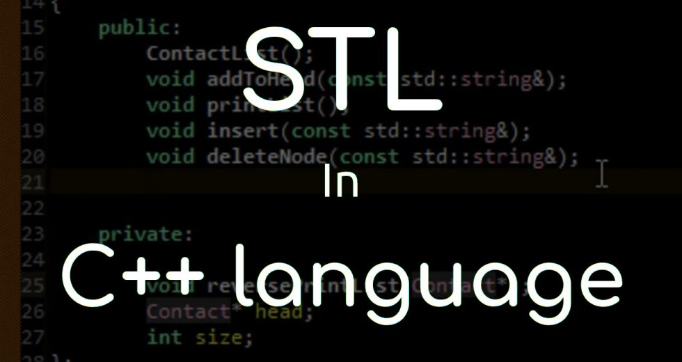

# 📗 概述

**Author： CJC From NJU**

**Email： 201220014@smail.nju.edu.cn**

## 前导知识

在正式学习STL之前，各位读者需要有一定的C++基础，包括且不限于：

* 熟悉C++继承自C的语法
* 基本掌握C++面向对象编程的全套相关内容
* 了解C++函数模版和类模版的特性用法


上述三条如果还无法达到的话，建议先寻找相关教程学习。本教程之后会默认各位小可爱已经具有了一定的C++基础，对于上述三点内容不再加以解释。


> 除了上述三点内容之外的其他内容，如果涉及，教程中会附上相关参考教程的链接，以供读者查阅。
>
> 本教程的部分内容基于南京大学2021春学期高级程序设计课程陈家骏老师课堂内容。

## 什么是STL？

除了从C标准库保留下来的一些功能之外，C++还提供了一个**基于模版**实现的**标准模版库（Standard Template Library, 简称STL）**。

* STL基于模版实现了一些面向序列数据的**表示**以及常用的**操作**
* STL支持了一种**抽象**的编程模式
  * 隐藏了一些低级的程序元素，如数组、链表、循环等



## STL包含什么？

**容器类模板**

容器用于存储**序列化的**数据，如：向量、队列、栈、集合等。&#x20;

**算法（函数）模板**

算法用于对容器中的数据元素进行一些常用**操作**，如：排序、统计等。

**迭代器类模板**

* 迭代器实现了**抽象的指针**功能，它们指向容器中的数据元素，用于对容器中的数据元素进行遍历和访问。
* **迭代器是容器和算法之间的桥梁**：传给算法的不是容器，而是指向容器中元素的迭代器，算法通过迭代器实现对容器中数据元素的访问。这样使得算法与容器保持独立，从而提高算法的通用性。



如果上述内容觉得云里雾里的话可以先按下不表，再STL具体学习的过程中慢慢体会。


## 基于STL编程的例子

```cpp
#include <iostream>
#include <vector>
#include <algorithm>
#include <numeric>
using namespace std;

void display(int x) { cout << ' ' << x; return; }
int main()
{
    vector<int> v; //创建容器对象v，元素类型为int
    int x;
    cin >> x;
    while (x > 0) //生成容器v中的元素
    {
        v.push_back(x); //往容器v中增加一个元素
        cin >> x;
    }
    //利用算法max_element计算并输出容器v中的最大元素
    cout << "Max = " << *max_element(v.begin(),v.end()) << endl;
    //利用算法accumulate计算并输出容器v中所有元素的和
    cout << "Sum = " << accumulate(v.begin(),v.end(),0) << endl;
    //利用算法sort对容器v中的元素进行排序
    sort(v.begin(),v.end()); 
    //利用算法for_each输出排序结果
    cout << "Sorted result is:\n";
    for_each(v.begin(),v.end(),display);
    cout << '\n';
    return 0;
}
```

> 用STL来实现上述程序的功能不需要涉及一些低级的程序元素，如数组、链表、循环，使得程序设计变得更便捷。


到此为止，小可爱们应当已经对C++STL有了一个概念上的大致印象。


