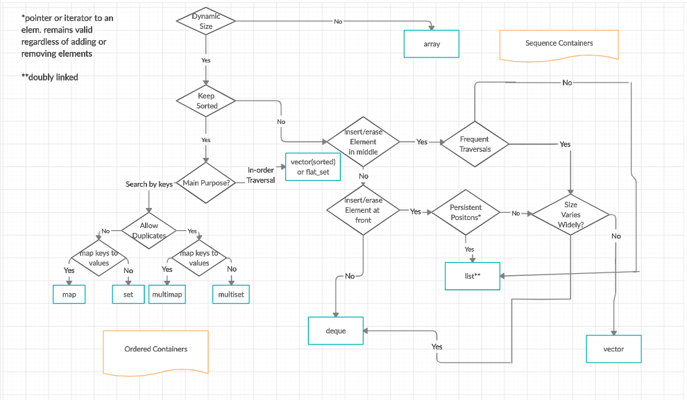
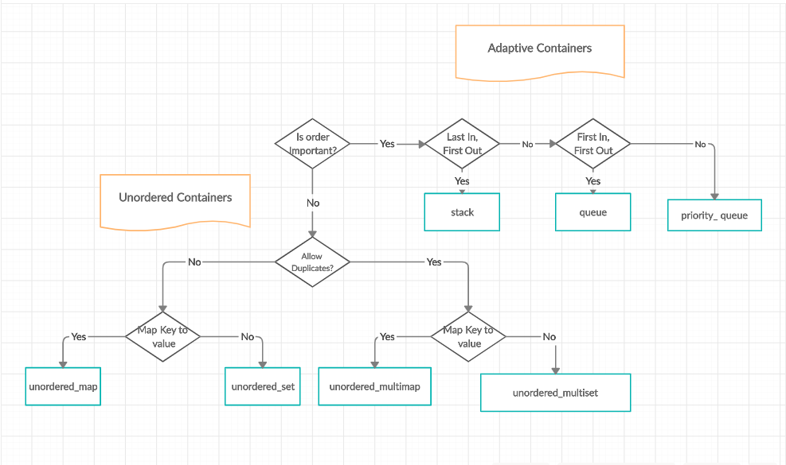

# 🍜 容器(Container)

## 后续内容的结构

在这个章节里面，我们会先具体讲述C++STL中提供的各种常用容器，每个容器大致会包含如下内容：

* 基本概念
* 迭代器类型
* 数据结构
* 常用API接口

## 如何选取合适的容器

根据前面的叙述，容器分为序列容器和容器适配器两种，其选择的主要流程如下：

对于上述流程或许现在还不太好完全理解，可以在后面一系列关于容器的具体教程学习完毕之后再回头看上面两幅流程图。


到此，读者应当了解了容器选择的基本过程，以及后续关于具体容器的教程的基本结构。

